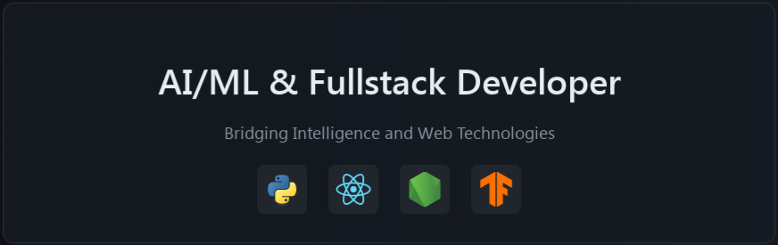
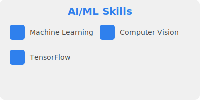
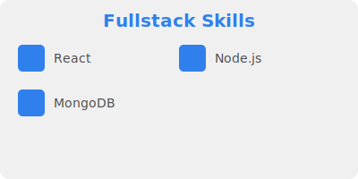

  

<h1 align="center">Hi there, I'm <a href="https://yourportfolio.com" target="_blank">Your Name</a>  </h1>

  

  &nbsp;
  &nbsp;
  

🚀 About Me

\`\`\`python
class AIFullstackDeveloper:
    def __init__(self):
        self.name = "Your Name"
        self.role = "AI/ML Engineer & Fullstack Developer"
        self.language_spoken = ["en_US", "es_ES", "zh_CN"]

    def say_hi(self):
        print("Thanks for dropping by! I'm passionate about pushing the boundaries of AI and web technologies.")

me = AIFullstackDeveloper()
me.say_hi()
\`\`\`

## 🔥 Streak Stats

<h3 align="center">⚡ Tech Stack</h3>

  

## 📊 Github Stats

  
<b>💻 GitHub Profile Stats</b>

   
  

    
 
  &nbsp;
	  
   
  

  

## 🎨 Featured Projects

<h3 align="center">🌟 Highlighted Skills</h3>

  
  

<h3 align="center">📬 Get in Touch</h3>

  
  

  

### Show some ❤️ by starring some of the repositories!

